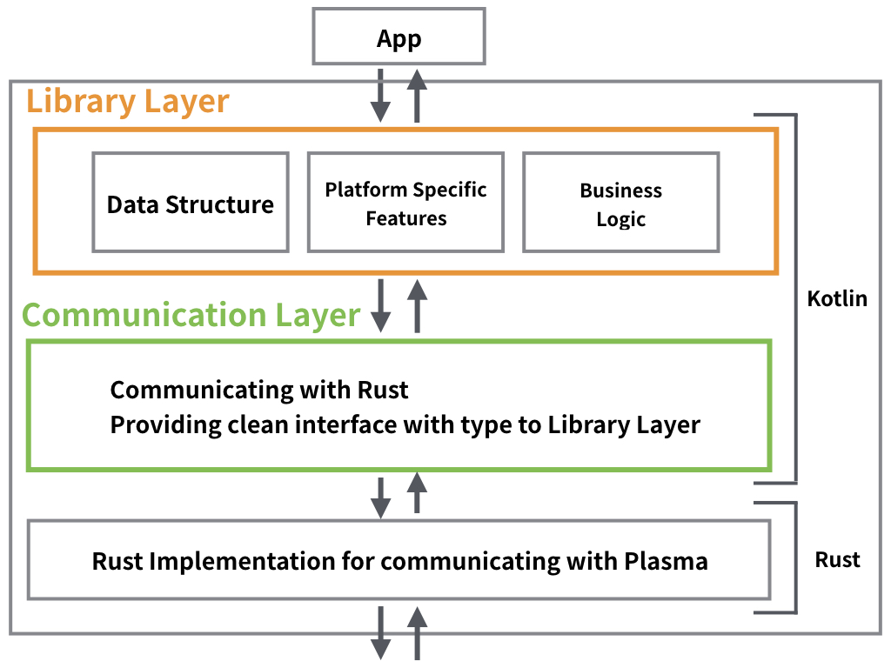

# plasma_android_sdk

## What
This is native sdk for android to communicate with Plasma.

## What is included
```
.
├── plasma_android_sdk      # android sdk (our main focus)
├── demo-hello-world        # demo app for printing hello world
├── demo-payment-usecase    # demo app for payment (still in WIP)
├── rust                    # rust implementation
│   ├── src                 # rust source code
│   ├── tools               # scripts to build or start up this project
├── LICENSE
└── README.md
```

## Architecture


## How to start
Usually you only need to do this process just once.

### Overview
- Install NDK Bundle
- Install target OS

### Install NDK Bundle
Install NDK (not NDK side by side) through Android Studio SDK Manager.
After installing NDK, set your path for `NDK_HOME` to something like `/Users/<YOUR-USER-NAME>/Library/Android/sdk/ndk-bundle`

now you should get

```
$ echo ${NDK_HOME}
# /Users/<YOUR-USER-NAME>/Library/Android/sdk/ndk-bundle
```

### Install target OS
`rust/tools/install_ndk.sh` is a simple shell script for you to build targets. This makes rust to build binary for android use.
As default, it will install in `<YOUR-HOME-PATH>/.NDK`.

### Copy and Edit config file
`rust/config.private` is a config file to build rust source code. Since this is user specific it is ignored from git. Just copy this file and rename it to `config` and edit `<YOUR-HOME-PATH>` to your actual home path.

### Add Android architectures to rustup

```
$ rustup target add aarch64-linux-android armv7-linux-androideabi i686-linux-android
```

## Build your binary for Android
If you are completely set, you can now build rust source code and use it from Android App.

### Build
There is another script for you to easily build and use it in android.
just run `rust/tools/build.sh`.

Make sure you are in directory `rust/` not `rust/tools`.

Your build command should look like

```
$ sh tools/build.sh
```

This will do all the following work for you.
1. copy config file to global config, so that `cargo build` will look at that config.
2. build rust source code to each OS targets.
3. Copy to Android Library directory so that binary used by jni is up to date.

### Hello World
Now you should be able to build `demo-hello-world` module and see "Hello from plasma rust sdk" on your screen.
