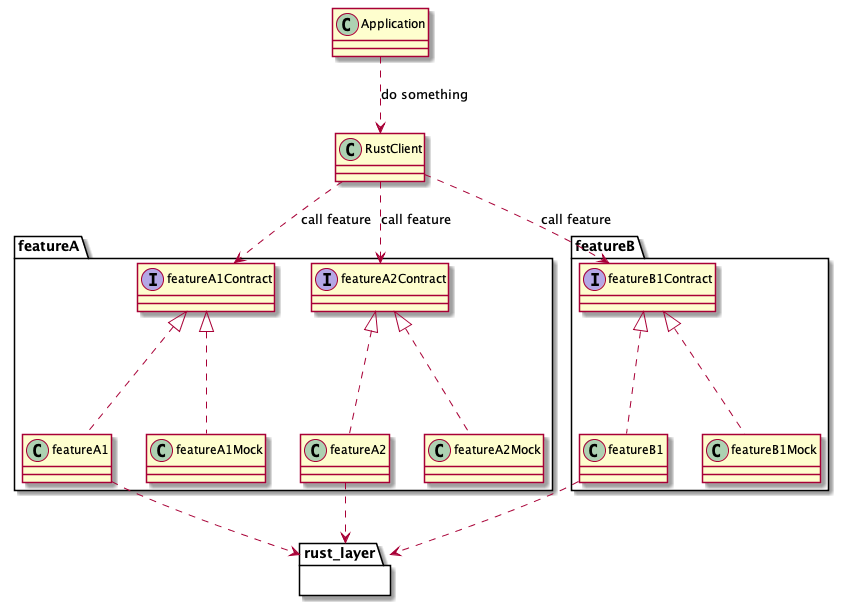

# Architecture

Following diagram shows how features and modules are implemented.

From application point of view, you can only access to public method of RustClient class.  
All the features are packed in package and all the methods are module private.  

Looking from library development all the feature classes are implementing Contract interface so you can mock the feature.  
